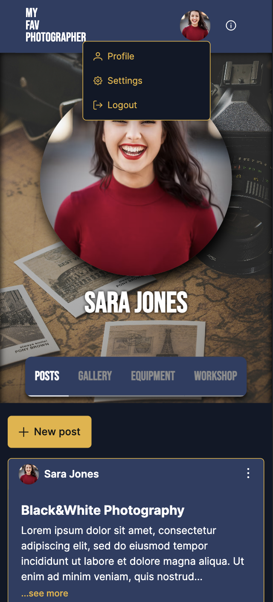

<div align="center">
<h1 align="center">📸 myFavPhotographer</h1>

<p float="left">
  
   
</p>


  <p align="center">
    The purpose of this project is to showcase the skills I acquired during my time at the 
      <a href="https://epicode.com/en/">Epicode</a>
      Web Developer Bootcamp.
    <br />
  </p>
</div>

## 🧑‍💻 About The Project

Sign up and follow your favorite photographers to stay up to date on their work and events, or purchase their printed
photos. Or if you are a photographer register to share your stories, photos, equipments and workshops with your followers.

### Live Demo

[📸 myFavPhotographer](https://my-fav-photographer.vercel.app/)

### Built With

* [![React][React.js]][React-url]
* [![Bootstrap][Bootstrap.com]][Bootstrap-url]
* [![Node][Node.js]][Node-url]
* [![Express][Express.js]][Express-url]
* [![MongoDB][MongoDB.com]][MongoDB-url]
* [![Mongoose][Mongoose.js]][Mongoose-url]

### Installation

1. Clone the repo
   ```sh
   git clone https://github.com/samspi-tech/my-fav-photographer.git
   ```
2. Setup .env for backend and frontend
   ```
   Create an .env file based on .env.example, for backend and frontend, and fill in your data.
   ```

3. Install backend NPM packages
   ```sh
   cd backend
   npm install
   ```
4. Run backend
   ```sh
   npm run dev
   ```  
5. Open new Terminal and install frontend NPM packages
   ```sh
   cd frontend
   npm install
   ```
6. Run frontend
   ```sh
   npm run dev
   ```

## 🙌 Contributing

Contributions are what make the open source community such an amazing place to learn, inspire, and create. Any
contributions you make are **greatly appreciated**.

If you have a suggestion that would make this better, please fork the repo and create a pull request. You can also
simply open an issue with the tag "enhancement".
Don't forget to give the project a star! Thanks again!

1. Fork the Project
2. Create your Feature Branch (`git checkout -b feature/AmazingFeature`)
3. Commit your Changes (`git commit -m 'Add some AmazingFeature'`)
4. Push to the Branch (`git push origin feature/AmazingFeature`)
5. Open a Pull Request

## 🔓 License

Distributed under the MIT License. See `LICENSE.txt` for more information.

## 📱 Contact

Andrea Facco - [@LinkedIn](https://www.linkedin.com/in/andrea-facco-2694a5346/)

[Express.js]: https://img.shields.io/badge/Express.js-000000?logo=express&logoColor=fff&style=flat

[Express-url]: https://expressjs.com/

[Mongoose.js]: https://img.shields.io/badge/-Mongoose-000?&logo=MongoDB&logoColor=white&s

[Mongoose-url]: https://mongoosejs.com/

[MongoDB.com]: https://img.shields.io/badge/-MongoDB-13aa52?style=for-the-badge&logo=mongodb&logoColor=white

[MongoDB-url]: https://www.mongodb.com/

[Node.js]: https://img.shields.io/badge/node.js-339933?style=for-the-badge&logo=Node.js&logoColor=white

[Node-url]: https://nodejs.org/en

[React.js]: https://img.shields.io/badge/React-20232A?style=for-the-badge&logo=react&logoColor=61DAFB

[React-url]: https://reactjs.org/

[Bootstrap.com]: https://img.shields.io/badge/Bootstrap-563D7C?style=for-the-badge&logo=bootstrap&logoColor=white

[Bootstrap-url]: https://getbootstrap.com
